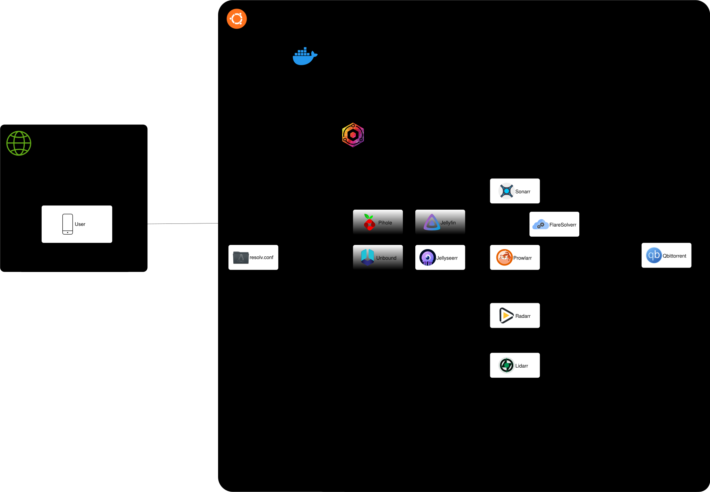

# homelab
Fully automated HomeLab from empty disk to running services with a single command.

## Configuration

Edit `.env.example` with desired configuration and copy/rename to `.env`.

## Port conflicts

### Open Media Vault

Change the OMV web port to `8000`.
```
sudo omv-firstaid
```
Option 3 to configure.

### systemd-resolved

Edit the configuration file and open with root privileges:
```
sudoedit /etc/systemd/resolved.conf 
```

Find the following line:
```
#DNSStubListener=yes.
```

Uncomment it (remove the #) and change the value to no. The line should look like: 
```
DNSStubListener=no.
```

## Start services

```
docker compose up -d
```

## Diagram



